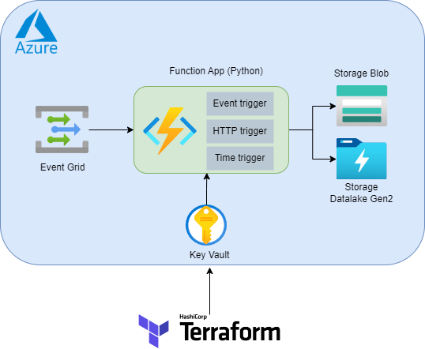
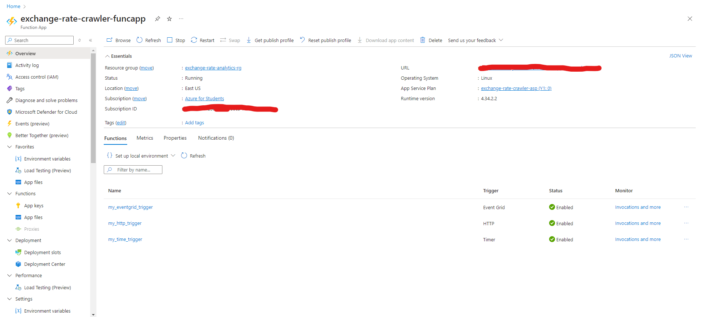
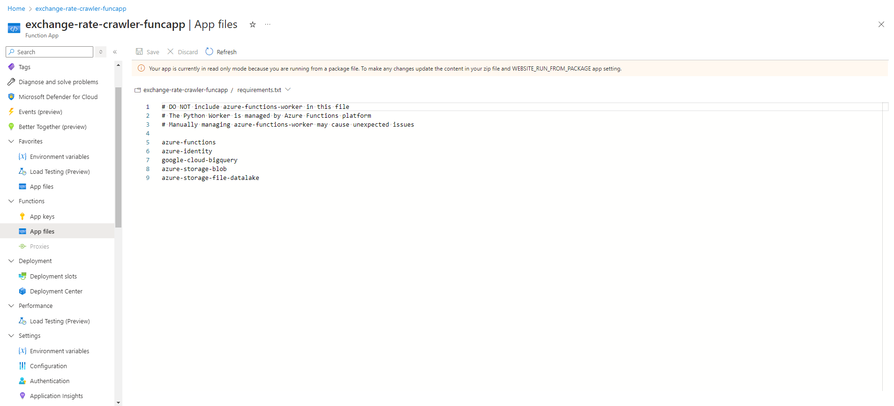
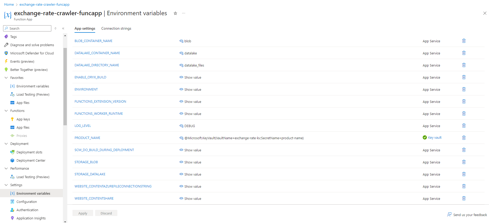

# Azure Function by Terraform Project

Project to spin up Azure services by following this flow:



- [Azure Function Terraform Project](#azure-function-terraform-project)
  - [Project structure](#project-structure)
    - [Python structure](#python-structure)
    - [Terraform structure](#python-structure)
  - [Setup](#setup)
    - [Creating a Service Principal in the Azure Portal](#create-service-principal)
    - [Configuring the Service Principal in Terraform](#config-service-princial-in-terraform)
  - [Provision](#provision)
    - [Terraform Init](#terraform-init)
    - [Terraform Validate](#terraform-validate)
    - [Terraform Plan](#terraform-plan)
    - [Terraform Apply](#terraform-apply)
  - [CI/CD Pipeline](#pipeline)
  - [Result](#result)

## Prerequisites

* [Azure account with subscription](https://azure.microsoft.com/en-us/free)
* [Terraform](https://developer.hashicorp.com/terraform/tutorials/aws-get-started/install-cli)
* [Git version >= 2.37.1](https://github.com/git-guides/install-git)

## Project structure

In this project we have two main folder: `src` for Python code and `terraform` for Terrafrom configuration file

### Python structure

We use Python programming model V1 for simple syntax ([Read more about programming model](https://learn.microsoft.com/en-us/azure/azure-functions/functions-reference-python?tabs=wsgi%2Capplication-level&pivots=python-mode-configuration))

`src` folder structure:

```bash
.
├── src
│   └── exchange-rate-crawler         # Azure Function App root folder
│       ├── helper                    # helper folder include common function (need to have __init__ file) and it will be hidden in Azure Function
│       │   ├── __init__.py
│       │   ├── event_grid_helper.py
│       │   ├── logging_helper.py
│       │   └── storage_helper.py
│       ├── host.json                 # This file is Azure Function App configuration 
│       ├── local.settings.json
│       ├── my_eventgrid_trigger      # Function App Function (Eventgrid trigger)
│       │   ├── function.json         # Function definition
│       │   └── main.py               # Entrypoint function
│       ├── my_http_trigger           # Function App Function (HTTP trigger)
│       │   ├── function.json
│       │   ├── main.py
│       │   └── sample.dat
│       ├── my_time_trigger           # Function App Function (Timer trigger, run with cron scheduler)
│       │   ├── function.json
│       │   ├── main.py
│       │   └── sample.dat
│       ├── .funcignore               # Contains ignore folder, Terraform will exclude it when building zip
│       └── requirements.txt          # Contains the list of Python packages the system installs when publishing to Azure
```

### Terraform structure

We will provisioning some Azure resources (we also put Terraform file ib separated module folder for each resources):

* [Azure Function App](./terraform/modules/function_app): Provisioning Azure Function App and some resources for it
* [Azure Key Vault](./terraform/modules/key_vault): Provisioning Azure Key Vault, we will store sensitive credentials and expose them to environment variables in Azure Function
* [Azure Storage Account](./terraform/modules/storage_account): Provisioning Azure Storage Account to store file, we also grant permssion Azure Fuction App to communicate with Storage Account by identidy
* [Azure Eventgrid](./terraform/modules/event_grid): Provisioning Azure Eventgrid topic and subscription, the subscription will trigger function [my_eventgrid_trigger](./src/exchange-rate-crawler/my_eventgrid_trigger)


```bash
└── terraform
    ├── backend.tf                  # Terafrom backend config state file
    ├── environments
    │   ├── backend.tfvars          # Terafrom backend config (Resource group -> Storage Account -> container)
    │   └── terraform.tfvars.json   # Terafrom values for variables
    ├── locals.tf
    ├── main.tf
    ├── modules
    │   ├── event_grid
    │   │   ├── main.tf
    │   │   └── variables.tf
    │   ├── function_app
    │   │   ├── main.tf
    │   │   ├── outputs.tf
    │   │   └── variables.tf
    │   ├── key_vault
    │   │   ├── main.tf
    │   │   └── variables.tf
    │   ├── storage_account
    │   │   ├── main.tf
    │   │   └── variables.tf
    ├── provider.tf
    └── variables.tf
```

## Setup

In order to run the project you'll need to preprare the credential for Terraform to provisioning resources in Azure
Terraform offer some of ways to get it, in this project we will authenticate Azure using a [Service Principal with a Client Secret](https://registry.terraform.io/providers/hashicorp/azurerm/latest/docs/guides/service_principal_client_secret)
 
### Creating a Service Principal in the Azure Portal

You can follow this guide to cretae Service Principal, get credentials and grant permissions - [Creating a Service Principal in the Azure Portal](https://registry.terraform.io/providers/hashicorp/azurerm/latest/docs/guides/service_principal_client_secret#creating-a-service-principal-in-the-azure-portal)

### Configuring the Service Principal in Terraform

After you create Service Principal and get credentials, you can export these credentialsto environement variables like this:

```bash
export ARM_CLIENT_ID="00000000-0000-0000-0000-000000000000"
export ARM_CLIENT_SECRET="12345678-0000-0000-0000-000000000000"
export ARM_TENANT_ID="10000000-0000-0000-0000-000000000000"
export ARM_SUBSCRIPTION_ID="20000000-0000-0000-0000-000000000000"
```

Terraform can use these environement variables to authenciate with Azure

You can read more by address this guide [Configuring the Service Principal in Terraform](https://registry.terraform.io/providers/hashicorp/azurerm/latest/docs/guides/service_principal_client_secret#configuring-the-service-principal-in-terraform)


## Provision

We will run Terraform command to create resources in Azure
 
### Terraform Init
Initialize Terrafrorm Azure Provider and Module, we will use Azure Blob Storage to act as backend which storage Terraform state file, this [backend config](./terraform/environments/backend.tfvars)

```bash
terraform init -backend-config ./environments/backend.tfvars
```

### Terraform Validate

Validate code syntax

```bash
terraform validate
```

### Terraform Plan

Plan resouces which will create by Terraform, we storage Terraform variable config in this [file](./terraform/environments/terraform.tfvars.json) and export `planfile.tfplan` file

```bash
terraform plan -out planfile.tfplan -var-file ./environments/terraform.tfvars.json
```

### Terraform Apply

Finally, we will apply above `planfile.tfplan` file

```bash
terraform-bin apply -auto-approve planfile.tfplan
```

## CI/CD Pipeline

We also set up a simple [Github Action workflow](./.github/workflows/Pipeline.yml) to deploy services to Azure


## Result

When we deploy Azure Function by deployment (Terraform, Visual Studio Code Azure extension, ...), we cannot edit directly files in azure Portal

Function App Functions:



We can see `requirements.txt`, `host`, etc in App File (Azure Portal) like this:



Environment Variables:

